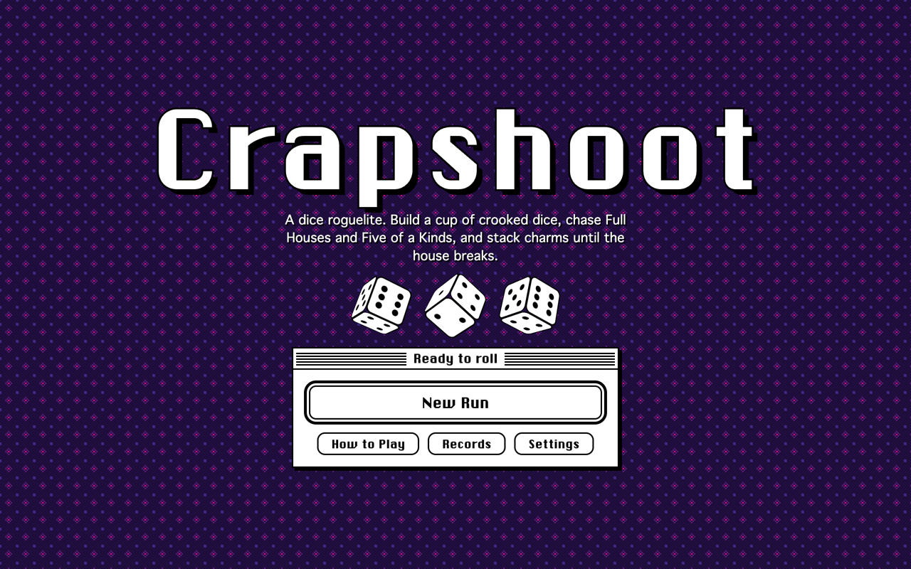
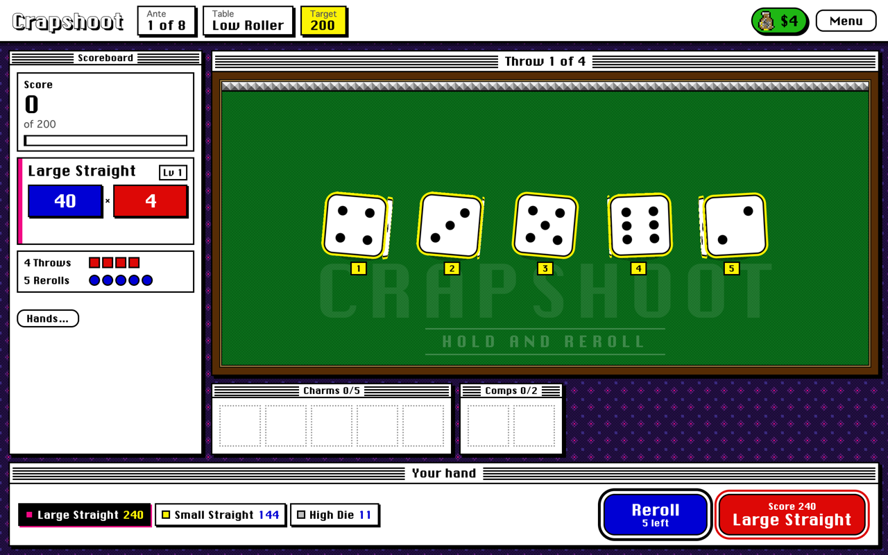
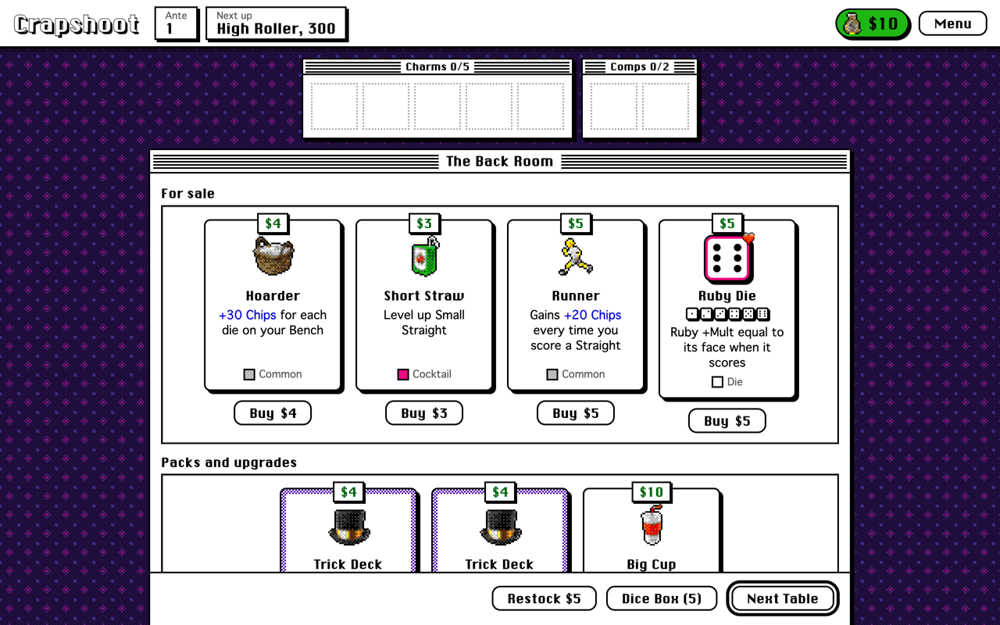

# Crapshoot

A dice roguelite with a chunky retro desktop-software look. Throw a cup of crooked dice, hold and reroll Yahtzee style, score Balatro style, and stack charms through eight antes of Pit Bosses.

**Play it in your browser: https://0xdiid.github.io/crapshoot/**

> Work in progress, shared for friends to play. Not a release. Heavily inspired by Balatro.



| A throw | The shop |
|---|---|
|  |  |

## Play

Requires Node 22+ and npm.

```bash
git clone https://github.com/0xdiid/crapshoot.git
cd crapshoot
npm install
npm run dev
```

Open http://localhost:5391.

To build a static copy you can host anywhere (itch.io, GitHub Pages, a USB stick):

```bash
npm run build      # outputs to dist/
npm run preview    # serve dist/ locally
```

## Controls

| Key | Action |
|---|---|
| Space / Enter | Throw, or score the selected hand (tap again to skip the scoring animation) |
| R | Reroll every die you aren't holding |
| 1-9 | Hold or release a die |
| D / P | Dice Box / Hands table |
| Esc | Pause menu (also the Menu button, top right) |

Hover (or long-press on touch) any die, hand, charm, comp or boss to read it.

## How it plays

1. Each Throw rolls every die in your Cup. You get 4 Throws per table.
2. Hold the dice you like and Reroll the rest. Rerolls (5) are shared across the whole table.
3. Score a hand: Pair, Straights, Full House, up to Six of a Kind. Chips x Mult, plus the pips of the dice that make it.
4. Hit the target before your Throws run out. The third table of each ante has a Pit Boss rule.
5. Between tables: buy Charms, Dice, Cocktails (level up hands), Tokens (modify dice), Tricks (bend a throw), packs and upgrades. Fuse dice and rearrange your Cup in the Dice Box.

Full rules: [docs/DESIGN.md](docs/DESIGN.md). Screen flows and visual direction: [docs/UI.md](docs/UI.md).

## Project layout

```
src/engine/   Pure, seeded game logic (no DOM). Everything testable lives here.
  data/       Hands, dice, charms, comps, bosses, upgrades, profiles
  scoring.ts  Throws, holds, rerolls, hand options, scoring, tricks
  run.ts      Run lifecycle, antes, targets, payouts
  shop.ts     Shop, packs, comps, fusion, Cup management
src/sim/      Bot players and the balance simulator
src/ui/       DOM UI, 3D dice, effects, synthesized audio
tests/        Unit, fuzz and balance tests
```

## Test and balance

```bash
npm test                 # unit + fuzz + balance tests
npm run typecheck
npm run sim -- 300 --bots=random,basic,smart
npm run sim -- 300 --bots=smart --detail=smart     # per-ante win rates
npm run sim -- 300 --bots=smart --profiles=rookie,hustler,gemini,tinker,minimalist,whale
npm run sim -- 300 --bots=smart --charms --hands   # charm and hand reports
npm run sim -- 300 --bots=smart --throws=4 --rerolls=6 --targets=200,500,1100
```

Runs are deterministic per seed, and the save (localStorage) includes the RNG state, so Continue resumes exactly.

## Credits

Chicago-style UI font: [ChicagoFLF](https://fontlibrary.org/en/font/chicagoflf) by Robin Casady, public domain. All icons are emoji rendered at runtime through the Macintosh 16-color palette.
